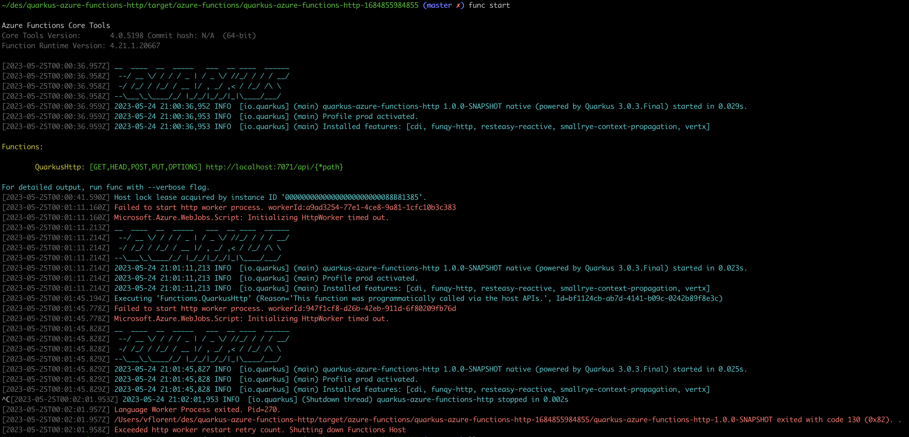

# quarkus-azure-functions-http

This project uses Quarkus, the Supersonic Subatomic Java Framework.

If you want to learn more about Quarkus, please visit its website: https://quarkus.io/ .

## Running the application in dev mode

You can run your application in dev mode that enables live coding using:
```shell script
./mvnw compile quarkus:dev
```

> **_NOTE:_**  Quarkus now ships with a Dev UI, which is available in dev mode only at http://localhost:8080/q/dev/.

## Packaging and running the application

The application can be packaged using:
```shell script
./mvnw package
```
It produces the `quarkus-run.jar` file in the `target/quarkus-app/` directory.
Be aware that it’s not an _über-jar_ as the dependencies are copied into the `target/quarkus-app/lib/` directory.

The application is now runnable using `java -jar target/quarkus-app/quarkus-run.jar`.

If you want to build an _über-jar_, execute the following command:
```shell script
./mvnw package -Dquarkus.package.type=uber-jar
```

The application, packaged as an _über-jar_, is now runnable using `java -jar target/*-runner.jar`.

## Creating a native executable

You can create a native executable using: 
```shell script
./mvnw package -Pnative
```

Or, if you don't have GraalVM installed, you can run the native executable build in a container using: 
```shell script
./mvnw package -Pnative -Dquarkus.native.container-build=true
```

You can then execute your native executable with: `./target/quarkus-azure-functions-http-1.0.0-SNAPSHOT-runner`

If you want to learn more about building native executables, please consult https://quarkus.io/guides/maven-tooling.

## Test using Azure Functions Core Tools (JVM Mode)

```
mvn clean package
```

```
cd target/azure-functions/quarkus-azure-functions-http-1684855984855
```

```
func start
```

```
curl localhost:7071/api/funq
```

```
curl localhost:7071/api/resteasy
```

## Test using Azure Functions Core Tools (Native Mode)

```
mvn clean package -Dnative
```

```
cp target/quarkus-azure-functions-http-1.0.0-SNAPSHOT target/azure-functions/quarkus-azure-functions-http-1684855984855
```

```
cd target/azure-functions/quarkus-azure-functions-http-1684855984855
```

Change function.json content to
```
{
  "bindings" : [ {
    "type" : "httpTrigger",
    "direction" : "in",
    "name" : "req",
    "route" : "{*path}",
    "methods" : [ "GET", "HEAD", "POST", "PUT", "OPTIONS" ],
    "dataType" : "binary",
    "authLevel" : "ANONYMOUS"
  }, {
    "type" : "http",
    "direction" : "out",
    "name" : "$return"
  } ]
}
```

Change host.json to
```
{
  "version": "2.0",
  "extensionBundle": {
    "id": "Microsoft.Azure.Functions.ExtensionBundle",
    "version": "[3.*, 4.0.0)"
  },
  "customHandler": {
    "description": {
      "defaultExecutablePath": "quarkus-azure-functions-http-1.0.0-SNAPSHOT",
      "workingDirectory": "",
      "arguments": []
    },
    "enableForwardingHttpRequest": true
  }
  
}

```

```
func start
```

```
curl localhost:7071/api/resteasy
```

Error message:




## Related Guides

- Azure Functions HTTP ([guide](https://quarkus.io/guides/azure-functions-http)): Write Microsoft Azure functions

## Provided Code

### Azure Functions HTTP Integration example

This example contains a HTTP function ready for Azure.

[Related guide section...](https://quarkus.io/guides/azure-functions-http)

> :warning: **INCOMPATIBLE WITH NATIVE**: Azure Functions Integration is not compatible with native yet!
